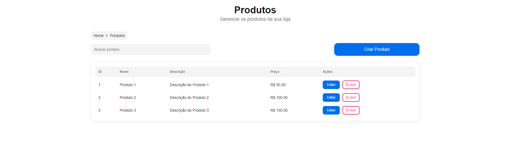
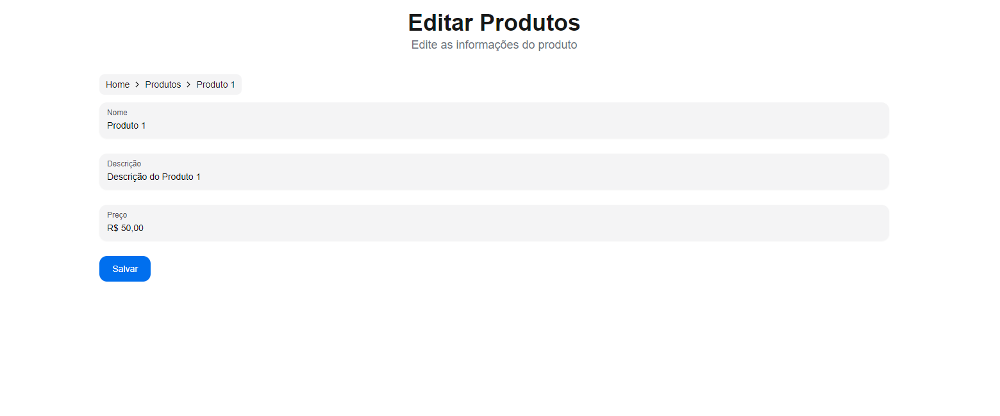
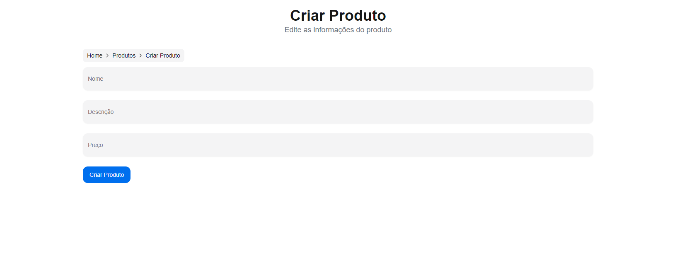
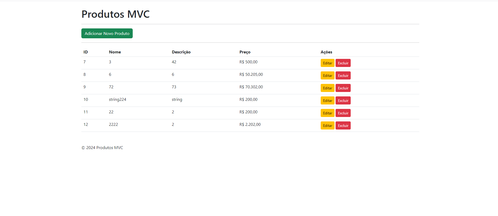
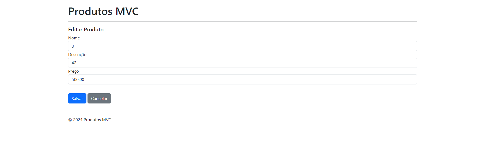
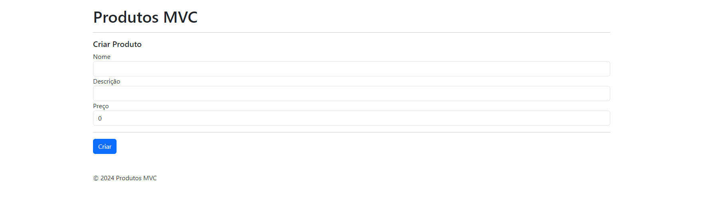
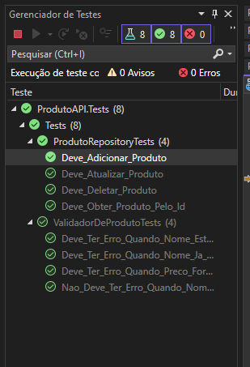
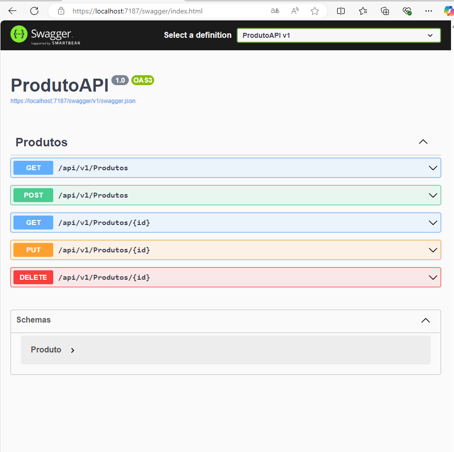

# Documentação do Projeto - API Produto 

## Estrutura do Projeto ( API .NET 8 )

A estrutura do projeto da API é organizada em camadas, cada uma com responsabilidades distintas. Abaixo está a estrutura de diretórios do projeto:

```
/src
  /ProdutoAPI
    ProdutoAPI.csproj
    Program.cs
    Controllers/
    Data/
    Models/
    Interfaces/
    Repositories/
    Views/
```

## Prints das Telas NextJS

### 1. Tela de Listagem ( NextJS )

A tela de listagem exibe todos os produtos registrados na aplicação. Veja a captura de tela abaixo:



### 2. Tela de Edição ( NextJS )

A tela de edição permite alterar os detalhes de um produto. Veja como ela se apresenta:



### 3. Tela de Adição ( NextJS )

Na tela de adição, é possível cadastrar novos produtos. Veja a captura abaixo:



## Prints das Telas MVC

### 1. Tela de Listagem ( MVC .Net 8 )

A tela de listagem exibe todos os produtos registrados na aplicação. Veja a captura de tela abaixo:



### 2. Tela de Edição ( MVC .Net 8 )

A tela de edição permite alterar os detalhes de um produto. Veja como ela se apresenta:



### 3. Tela de Adição ( MVC .Net 8 )

Na tela de adição, é possível cadastrar novos produtos. Veja a captura abaixo:



## Prints dos Testes Unitários 

Abaixo está a captura de tela dos testes unitários sendo executados:



## Print do Swagger 

O Swagger está disponível para facilitar o teste das rotas da API. Abaixo está uma captura de tela da interface do Swagger:




## Descrição das Camadas e Responsabilidades

1. **Camada de Controladores (Controllers)**:
   - Responsável por definir os endpoints da API e controlar o fluxo das requisições HTTP.
   - Os controladores recebem as requisições, validam as entradas e interagem com a camada de serviço/repositório para retornar os resultados.
   
2. **Camada de Dados (Data)**:
   - Contém a classe `AppDbContext` que gerencia a conexão com o banco de dados e as operações de CRUD.
   - Utiliza o Entity Framework Core para interagir com o banco de dados, aplicando as migrações e gerenciando as entidades.

3. **Camada de Interfaces (Interfaces)**:
   - Define as interfaces para os repositórios que abstraem a interação com a camada de dados.
   - `IProdutoRepository` é um exemplo de interface que define os métodos para realizar operações relacionadas ao produto.

4. **Camada de Modelos (Models)**:
   - Contém as classes de modelo, que representam as entidades no banco de dados.
   - `Produto.cs` é um exemplo de modelo que define as propriedades e validações do produto.

5. **Camada de Repositórios (Repositories)**:
   - Implementa as interfaces definidas na camada de `Interfaces`.
   - `ProdutoRepository.cs` é a implementação que utiliza `AppDbContext` para realizar operações de banco de dados relacionadas aos produtos.

6. **Camada de Validadores (Validators)**:
   - Utiliza o FluentValidation para validar as entradas de dados antes de serem processadas.
   - `ProdutoValidator.cs` contém as regras de validação para garantir que os dados enviados estejam corretos.

## Explicação sobre a Escolha de Tecnologias e Padrões de Projeto

- **.NET 8**: Escolhemos o .NET como a tecnologia principal para o desenvolvimento da API, devido à sua robustez, alta performance e boa integração com bancos de dados relacionais. O .NET oferece uma excelente plataforma para construção de APIs e tem suporte nativo para o Entity Framework Core, facilitando a interação com o banco de dados.
  
- **FluentValidation**: Utilizado para validar dados de entrada de forma elegante e eficiente. Ao usar o FluentValidation, podemos centralizar as regras de validação em uma única camada e manter a lógica de validação separada da lógica de negócios.

- **Entity Framework Core**: Usado para realizar operações de CRUD com o banco de dados. Ele permite uma integração fácil e eficiente com bancos de dados SQL Server, permitindo migrações e gerenciamento de entidades de forma simplificada.

- **Docker**: Utilizado para facilitar a construção e a execução da API em ambientes consistentes. Com Docker, podemos criar uma imagem da aplicação e executá-la em qualquer ambiente sem a necessidade de configuração adicional.

- **Swagger**: Implementado para fornecer uma interface interativa para testar os endpoints da API diretamente pelo navegador. Facilita o desenvolvimento e a documentação da API.

## Plano de Testes

O plano de testes para o projeto foca em cobrir os principais cenários de funcionamento da API, garantindo que as funcionalidades críticas estejam funcionando conforme esperado. Abaixo estão os cenários cobertos pelos testes unitários:

### **Cenários de Testes Unitários**:

1. **Testes de Produto**:
   - **Criar Produto**: Verifica se a criação de um novo produto está funcionando corretamente, com validações adequadas.
   - **Atualizar Produto**: Testa a atualização de um produto existente.
   - **Excluir Produto**: Valida a exclusão de um produto existente.
   - **Buscar Produto**: Verifica se a busca por produtos por ID e outros parâmetros está funcionando corretamente.

2. **Testes de API (Usando Swagger)**:
   - **Endpoints de CRUD**: Testa os endpoints de criação, leitura, atualização e exclusão de produtos para garantir que a API esteja respondendo corretamente às requisições HTTP.

3. **Testes de API (Usando Postman)**:
   - **Endpoints de CRUD**: Criei uma coleção com os endpoints para testar pelo Postman.


# Como Rodar o Projeto

Este guia descreve as etapas para rodar o projeto "ProdutoAPI" desde a instalação até a execução no ambiente de desenvolvimento.

## Etapa 1: Pré-requisitos

Antes de rodar o projeto, certifique-se de ter os seguintes itens instalados:

1. **Docker**:
   - Baixe e instale o Docker a partir de [aqui](https://www.docker.com/get-started).

2. **.NET SDK** (caso deseje rodar localmente sem o Docker):
   - Baixe e instale o SDK mais recente a partir de [aqui](https://dotnet.microsoft.com/download).

3. **Visual Studio Code** (ou qualquer editor de sua preferência):
   - Baixe e instale o Visual Studio Code a partir de [aqui](https://code.visualstudio.com/).

## Etapa 2: Rodando com Docker

1. **Criar a Imagem do Docker**

   Execute o comando para criar a imagem Docker para o projeto:

   `docker build -t produto-api .`

   O comando irá construir a imagem utilizando o `Dockerfile` presente no projeto e nomear a imagem como `produto-api`.

2. **Rodar o Container**

   Após criar a imagem, execute o container com o seguinte comando:

   `docker run -p 5000:80 produto-api`

   Este comando executa o container e mapeia a porta 80 do container para a porta 5000 da sua máquina local. Assim, você poderá acessar a API pelo endereço `http://localhost:5000`.

## Etapa 3: Rodando Localmente (sem Docker)

Caso prefira rodar o projeto localmente (sem Docker), siga as etapas abaixo:

1. **Restaurar Dependências**

   Navegue até o diretório do projeto e execute o comando para restaurar as dependências:

   `dotnet restore`

2. **Executar a Aplicação**

   Execute o comando para rodar a aplicação localmente:

   `dotnet run`

   A API será iniciada e você poderá acessá-la em `http://localhost:5000`.

## Etapa 4: Acessando a API

Após rodar o container ou a aplicação localmente, a API estará acessível através do endereço:

http://localhost:5000

## Etapa 5: Banco de Dados e Migrations

### 1. Criar a Migration

Se for a primeira vez que você está rodando o projeto ou se houve mudanças no modelo de dados, você precisará criar a migration para o banco de dados.

Para isso, execute o seguinte comando na raiz do projeto (onde o `ProdutoAPI.csproj` está localizado):

`dotnet ef migrations add InitialCreate`

Este comando irá gerar uma migration chamada `InitialCreate` com as alterações do modelo de dados.

### 2. Atualizar o Banco de Dados

Após criar a migration, execute o seguinte comando para aplicar as mudanças no banco de dados:

`dotnet ef database update`

Isso criará o banco de dados e aplicará as migrations necessárias de acordo com o modelo da aplicação.

### 3. Verificando a Conexão

Para garantir que a migration foi aplicada corretamente e o banco de dados está configurado, você pode verificar a conexão e acessar os dados diretamente através da API.

Se você estiver usando Docker, o processo de execução do container também irá aplicar a migration automaticamente, como configurado no `Program.cs`. Caso contrário, siga as etapas acima para rodar localmente.

### Observações

- O comando `dotnet ef database update` deve ser executado toda vez que uma nova migration for adicionada.
- Certifique-se de que a string de conexão no arquivo `appsettings.json` esteja corretamente configurada para o banco de dados que deseja utilizar.

