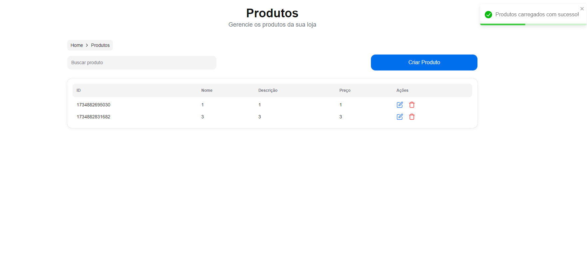

# Documentação do Projeto - API Produto ( AspNet + MVC + NextJS + SqlSerer)

## Prints das Telas NextJS

### 1. Tela de Listagem ( NextJS )

A tela de listagem exibe todos os produtos registrados na aplicação. Veja a captura de tela abaixo:



### 2. Tela de Edição ( NextJS )

A tela de edição permite alterar os detalhes de um produto. Veja como ela se apresenta:


### 3. Tela de Adição ( NextJS )

Na tela de adição, é possível cadastrar novos produtos. Veja a captura abaixo:


## Prints das Telas MVC

### 1. Tela de Listagem ( MVC )

A tela de listagem exibe todos os produtos registrados na aplicação. Veja a captura de tela abaixo:


### 2. Tela de Edição ( MVC )

A tela de edição permite alterar os detalhes de um produto. Veja como ela se apresenta:


### 3. Tela de Adição ( MVC )

Na tela de adição, é possível cadastrar novos produtos. Veja a captura abaixo:


## Prints dos Testes Unitários 

Abaixo está a captura de tela dos testes unitários sendo executados:


## Print do Swagger 

O Swagger está disponível para facilitar o teste das rotas da API. Abaixo está uma captura de tela da interface do Swagger:


## Descrição das Camadas e Responsabilidades

1. **Camada de Controladores (Controllers)**:
   - Define os endpoints da API e gerencia o fluxo das requisições HTTP.
   - Recebe as requisições, valida as entradas e interage com a camada de serviço/repositório para retornar os resultados.

2. **Camada de Dados (Data)**:
   - Contém a classe `AppDbContext` que gerencia a conexão com o banco de dados e as operações de CRUD.
   - Utiliza o Entity Framework Core para interagir com o banco de dados, aplicando as migrações e gerenciando as entidades.

3. **Camada de Interfaces (Interfaces)**:
   - Define as interfaces para os repositórios que abstraem a interação com a camada de dados.
   - `IProdutoRepository` é um exemplo de interface que define os métodos para realizar operações relacionadas ao produto.

4. **Camada de Modelos (Models)**:
   - Contém as classes de modelo, que representam as entidades no banco de dados.
   - `Produto.cs` é um exemplo de modelo que define as propriedades e validações do produto.

5. **Camada de Repositórios (Repositories)**:
   - Implementa as interfaces definidas na camada de `Interfaces`.
   - `ProdutoRepository.cs` utiliza `AppDbContext` para realizar operações de banco de dados relacionadas aos produtos.

6. **Camada de Validadores (Validators)**:
   - Utiliza o FluentValidation para validar as entradas de dados antes de serem processadas.
   - `ProdutoValidator.cs` contém as regras de validação para garantir que os dados enviados estejam corretos.

7. **Camada de Views (Views)**:
   - Responsável por renderizar as respostas da API ou fornecer interfaces adicionais, se necessário.

## Explicação sobre a Escolha de Tecnologias e Padrões de Projeto

- **.NET 8**: Escolhemos o .NET como a tecnologia principal para o desenvolvimento da API, devido à sua robustez, alta performance e boa integração com bancos de dados relacionais. O .NET oferece uma excelente plataforma para construção de APIs e tem suporte nativo para o Entity Framework Core, facilitando a interação com o banco de dados.
  
- **FluentValidation**: Utilizado para validar dados de entrada de forma elegante e eficiente. Ao usar o FluentValidation, podemos centralizar as regras de validação em uma única camada e manter a lógica de validação separada da lógica de negócios.

- **Entity Framework Core**: Usado para realizar operações de CRUD com o banco de dados. Ele permite uma integração fácil e eficiente com bancos de dados SQL Server, permitindo migrações e gerenciamento de entidades de forma simplificada.

- **Docker**: Utilizado para facilitar a construção e a execução da API em ambientes consistentes. Com Docker, podemos criar uma imagem da aplicação e executá-la em qualquer ambiente sem a necessidade de configuração adicional.

- **Swagger**: Implementado para fornecer uma interface interativa para testar os endpoints da API diretamente pelo navegador. Facilita o desenvolvimento e a documentação da API.

## Plano de Testes

O plano de testes para o projeto foca em cobrir os principais cenários de funcionamento da API, garantindo que as funcionalidades críticas estejam funcionando conforme esperado. Abaixo estão os cenários cobertos pelos testes unitários:

### **Cenários de Testes Unitários**:

1. **Testes de Produto**:
   - **Adicionar Produto**: Verifica se a criação de um novo produto está funcionando corretamente, com validações adequadas.
   - **Atualizar Produto**: Testa a atualização de um produto existente.
   - **Excluir Produto**: Valida a exclusão de um produto existente.
   - **Buscar Produto**: Verifica se a busca por produtos por ID e outros parâmetros está funcionando corretamente.

2. **Testes de API (Usando Swagger)**:
   - **Endpoints de CRUD**: Testa os endpoints de criação, leitura, atualização e exclusão de produtos para garantir que a API esteja respondendo corretamente às requisições HTTP.

3. **Testes de API (Usando Postman)**:
   - **Endpoints de CRUD**: Criei uma coleção com os endpoints para testar pelo Postman.


# Como Rodar o Projeto

Este guia descreve as etapas para rodar o projeto "ProdutoAPI" desde a instalação até a execução no ambiente de desenvolvimento.

## Etapa 1: Pré-requisitos

Antes de rodar o projeto, certifique-se de ter os seguintes itens instalados:

1. **Docker**:
   - Baixe e instale o Docker a partir de [aqui](https://www.docker.com/get-started).

2. **.NET SDK** (caso deseje rodar localmente sem o Docker):
   - Baixe e instale o SDK mais recente a partir de [aqui](https://dotnet.microsoft.com/download).

3. **Visual Studio Code** (ou qualquer editor de sua preferência):
   - Baixe e instale o Visual Studio Code a partir de [aqui](https://code.visualstudio.com/).

## Etapa 2: Rodando com Docker

# Como Rodar o Projeto

Este guia descreve as etapas para rodar o projeto "ProdutoAPI" utilizando Docker Compose.

## Etapa 1: Buildar o Docker Compose

Execute o seguinte comando na raiz do projeto para construir os containers definidos no 
`docker-compose.yml`:

```bash
docker-compose build
```

## Etapa 2: Rodar a Imagem
Após a construção das imagens, inicie os serviços com o comando:

```bash
docker-compose up -d
```

Este comando irá subir os containers em segundo plano.

## Etapa 3: Acessar Swagger, MVC e Next.js
Após rodar os containers, acesse as seguintes interfaces no seu navegador:


- Swagger: http://localhost:5000/swagger
- MVC: http://localhost:5000/mvc
- Next.js: http://localhost:3000


Observação: Certifique-se de que as portas mencionadas correspondem às configuradas no seu docker-compose.yml. Caso contrário, ajuste os URLs de acordo com as portas utilizadas.

### Observações

- O comando `dotnet ef database update` deve ser executado toda vez que uma nova migration for adicionada.


